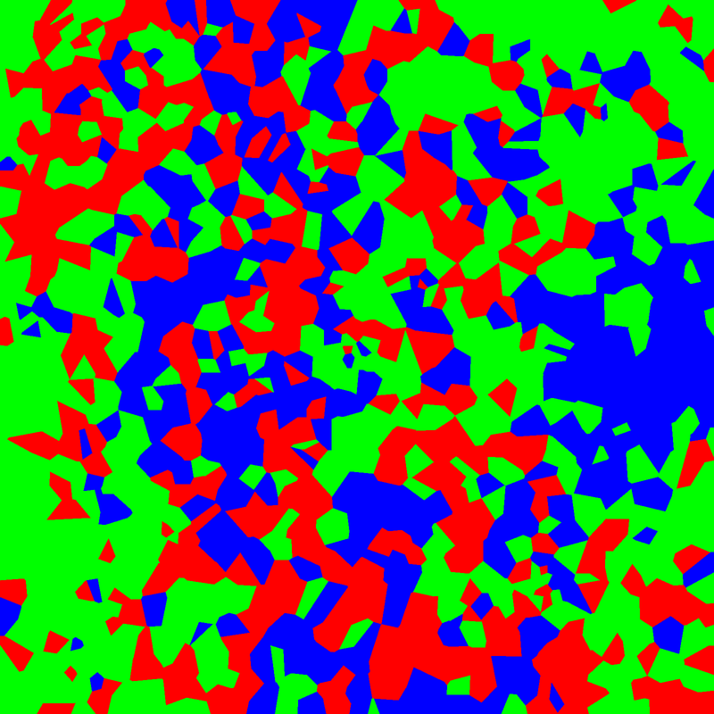
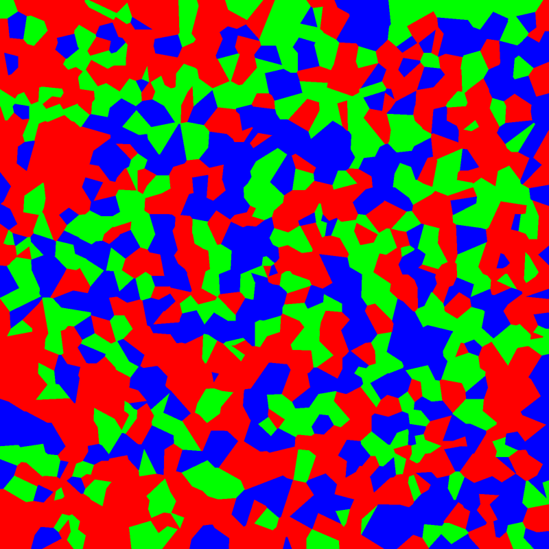
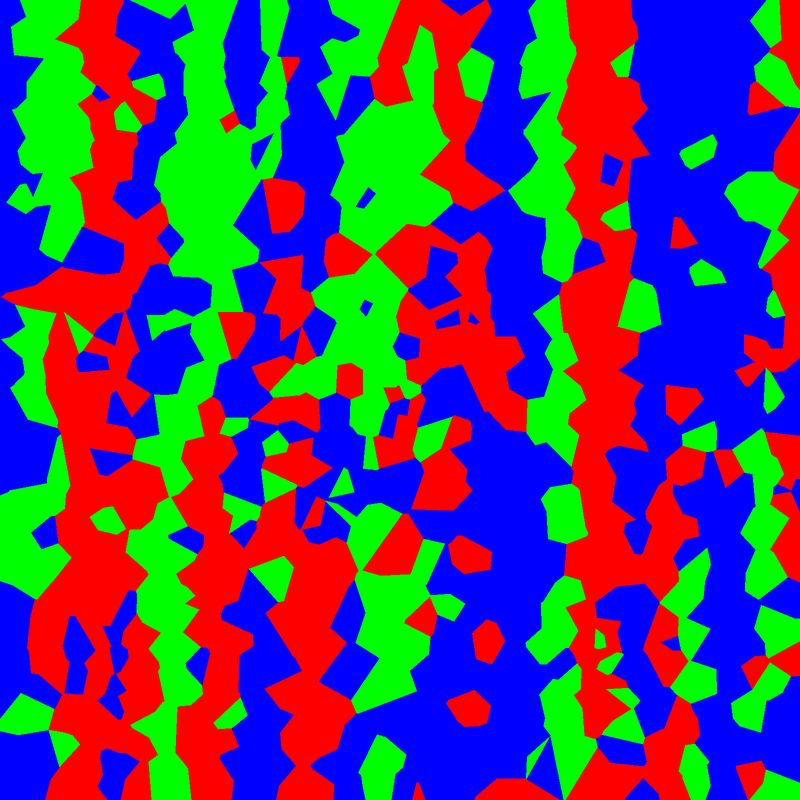
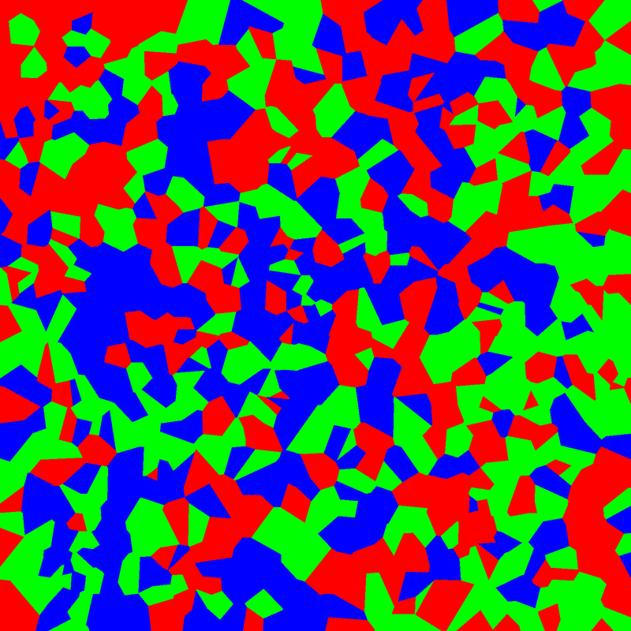
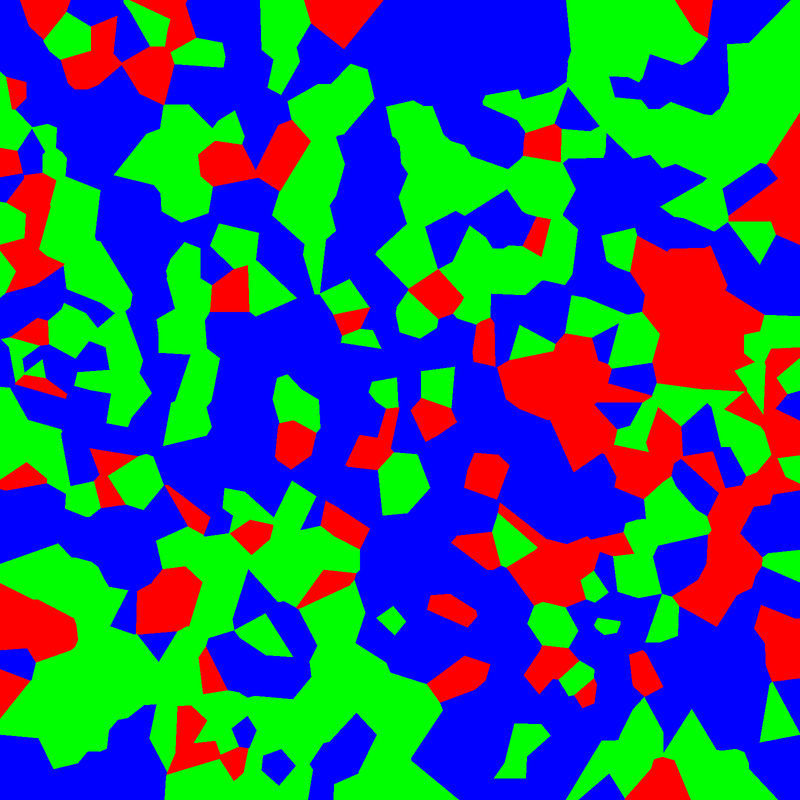
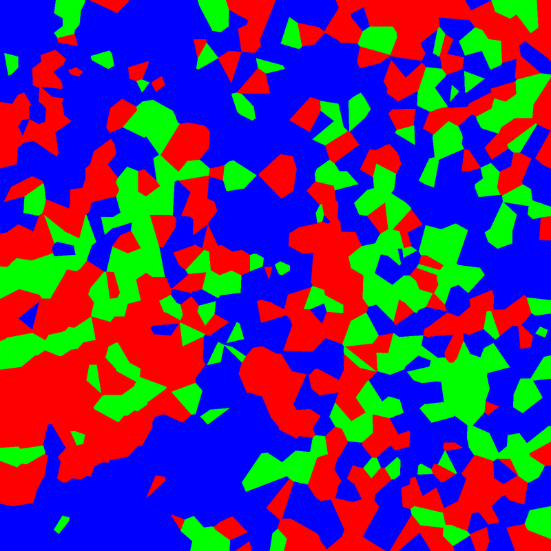

# discrete-lic

**Line Integral Convolution over discrete RGB primaries.**

Each noise pixel is assigned exactly one pure primary color — red, green, or blue. LIC
convolution then smears these primaries along streamlines of a vector field. The result is
an image where every pixel is still only one primary, but regions of like-colored pixels
cluster into organic, flow-following shapes. From up close: colored noise. From a distance:
turbulence, vortices, shear.

The discrete-primary mode (`--color pure_rgb`) has no practical signal-processing use. It
exists because it looks interesting.

---

| | | |
|---|---|---|
|  |  |  |
| Perlin curl · Voronoi | Rotation · Voronoi | Double vortex · Voronoi |
|  |  |  |
| Spiral · Voronoi | Wave · Voronoi | z² · Voronoi |

More examples: [angle_hsv](web/gallery/angle_hsv_perlin_voronoi.png),
[colormap](web/gallery/colormap_wave_voronoi.png),
[grid mode](web/gallery/pure_rgb_perlin_grid.png).

---

## Quick start

```bash
git clone https://github.com/YOURNAME/discrete-lic
cd discrete-lic
pip install -r requirements.txt

# CLI — pure RGB Voronoi (the headline mode, ~1 s)
python src/lic_main.py --field perlin_curl --color pure_rgb --pixel-mode voronoi

# Web app
uvicorn web.server:app --reload
# open http://localhost:8000
```

The web app has a **Gallery** tab (pre-generated examples) and a **Generator** tab with sliders
for all parameters. Images are generated on the server and returned as PNG.

---

## How it works

**LIC** (Line Integral Convolution, Cabral & Leedom 1993) filters an input texture by
integrating it along streamlines of a vector field. Each output pixel receives the weighted
average of the input texture along the streamline passing through it. The result reveals
the topology of the field as a smooth, oriented texture.

**Discrete-primary noise** replaces the usual white noise with a texture where every pixel
is exactly one of three pure primaries: (255,0,0), (0,255,0), or (0,0,255). After LIC, each
output pixel holds a probability distribution over the three primaries (the proportions of
R, G, B accumulated along its streamline). A sharpening exponent is applied, then one primary
is sampled stochastically — so each pixel is still one pure color, but the choice is biased
toward whichever primary dominated that streamline.

**Voronoi-pixel mode** (`--pixel-mode voronoi`) replaces the uniform pixel grid with an
irregular Voronoi tessellation. Each cell gets one noise value; LIC traces one streamline per
cell. The output is painted cell-by-cell with exact Voronoi polygon geometry. The effect is
a bold mosaic where the cell shapes themselves become part of the composition. Voronoi mode
is also ~30× faster than grid mode for the same image size.

---

## CLI reference

```
python src/lic_main.py [OPTIONS]
```

| Flag | Default | Description |
|------|---------|-------------|
| `--field` | `rotation` | Vector field: `uniform`, `rotation`, `source`, `sink`, `saddle`, `shear`, `double_vortex`, `wave`, `perlin_curl`, `spiral`, `complex`, `mhd_cluster`*, `wd_merger`* |
| `--field-expr` | `z**2` | Python expression for `--field complex`, e.g. `np.sin(z*4)` |
| `--color` | `rgb` | Color strategy: `pure_rgb`, `angle_hsv`, `colormap`, `rgb`, `hsv_noise` |
| `--pixel-mode` | `grid` | `grid` (pixels) or `voronoi` (irregular cells) |
| `--voronoi-cells` | `800` | Number of Voronoi cells |
| `--steps` | `30` | Integration steps per direction |
| `--kernel` | `box` | Kernel: `box`, `gaussian`, `raised_cosine` |
| `--pure-mode` | `stochastic` | Pure RGB sub-mode: `stochastic` or `streamline` |
| `--pure-sharpen` | `2.5` | Sharpness exponent (1=flat, 2–4=good, >10=hard argmax) |
| `--colormap` | `viridis` | Matplotlib colormap for `--color colormap` |
| `--width` / `--height` | `800` | Output dimensions in pixels |
| `--output` | `lic_out.png` | Output path; format from extension: `.png`, `.tif`, `.jpg`, `.pdf` |
| `--seed` | `17` | Random seed |

*requires yt (see below)

**Example commands:**
```bash
# Pure RGB grid mode with streamline painting
python src/lic_main.py --field perlin_curl --color pure_rgb --pure-mode streamline

# Flow direction as hue, LIC as brightness
python src/lic_main.py --field double_vortex --color angle_hsv --steps 50 --kernel gaussian

# Custom complex analytic field
python src/lic_main.py --field complex --field-expr "np.sin(z*4)" --color angle_hsv

# Large print file
python src/lic_main.py --width 4000 --height 6000 --field perlin_curl --color pure_rgb \
  --pixel-mode voronoi --voronoi-cells 8000 --output print.tif
```

---

## Optional: yt-backed fields

Two fields load scientific simulation data via [yt](https://yt-project.org/):

- `mhd_cluster` — magnetized galaxy cluster (MHDSloshing, ~1.5 GB, auto-downloaded)
- `wd_merger` — white dwarf merger magnetic field snapshot (~1.6 GB, auto-downloaded)

Install yt support:
```bash
pip install -r requirements-yt.txt
python src/lic_main.py --field mhd_cluster --color pure_rgb --pixel-mode voronoi
```

The download happens once via `yt.load_sample()` and is cached locally.

---

## Gallery regeneration

To regenerate the bundled gallery images from scratch:
```bash
python scripts/generate_gallery.py          # skip existing
python scripts/generate_gallery.py --force  # regenerate all
```

---

## License

MIT
